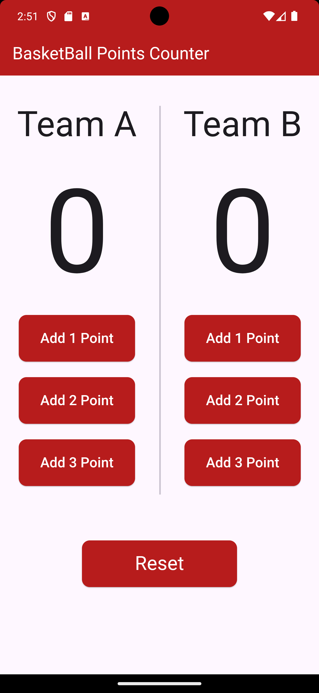

# Basketball Counter



**Basketball Counter** is a simple Flutter application for counting basketball points for two teams. This project demonstrates the use of Flutter for creating a basic stateful widget application.

## Features
- Count points for Team A and Team B.
- Add 1, 2, or 3 points with dedicated buttons.
- Reset the points for both teams.

## Getting Started

### Prerequisites
- Flutter SDK

### Setup
1. **Clone the repository:**
   ```bash
   git clone https://github.com/yourusername/BasketballCounter.git
